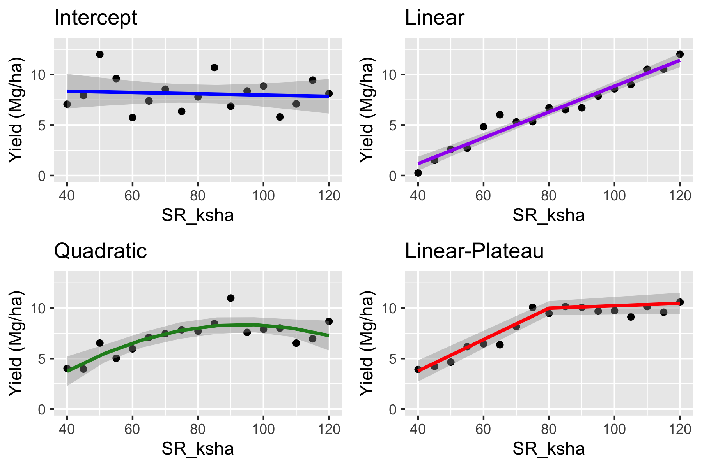

# 1) Housekeeping

-   ANOVA (first part, already covered) vs. Regression (second part, today).
-   ANOVA part can be found here: <https://github.com/leombastos/2020_rworkshop_designanovareg>
-   Questions: post in the chat, moderator will read.
-   Technical issues.
-   Literate programming (feel free to take your own notes outside chunks)
-   TOC
-   agRonomy blog: <https://agronomy.netlify.app>

# 2) Introduction

This script was written for teaching during the KSU-UGA Agronomy R Workshop - ANOVA vs. Linear Regression.

During this second part, we are going to explore the following topics:

-   One data set containing corn grain yield response to seeding rate coming from a *well-conducted randomized complete-block design*.

-   Complete linear regression analysis

-   data import,
-   exploratory data analysis,
-   formal statistical analysis,
-   model summary,
-   final plot.

-   Complete **quadratic** linear regression on data.

-   Complete **linear-plateau** non-linear regression on data.

-   Compare quadratic vs. linear-plateau regressions. Which one fits the data best? Choose one to proceed and use in the next steps.

-   Use regression for finding level of input (seeds/ha) that optimize crop output (yield).

-   Use regression for prediction.

-   Discuss about ANOVA (yesterday) and regression differences, and when we use each case.

# 3) Setup

Here is where we load the packages we will use.

```{r setup}
# Loading packages
library(tidyverse) # for data wrangling and plotting
library(janitor) # clean column names
library(lmerTest) # for mixed-effect modeling
library(broom.mixed) # for residual diagnostics
library(knitr) # for figure displaying
library(nlme) # for non-linear modeling
library(metrica) # for rmse

```

# 4) Linear regression  

## a) Data import  

```{r reg data import}
reg_df 

reg_df
```

## b) Data summary and wrangling

```{r reg summary}
summary(reg_df)
```

```{r reg glimpse}
glimpse(reg_df)
```

```{r reg wrangling}
reg_dfw 

reg_dfw
```

## c) Exploratory Data Analysis

```{r reg exp boxplot}


```

What is going on with this boxplot?

```{r reg plot point + smooth}
ggplot(reg_dfw, aes(x = sr_ksha, y = yield_mgha))+
  geom_point(size = 3, alpha = .7)

```

## d) Statistical model

```{r reg linear model}
# Changing to sum-to-zero contrast
options(contrasts = c("contr.sum", "contr.poly"))

# Model fitting
reg_lin_mod 

# Summary
summary(reg_lin_mod)

```

## e) Model Assumptions

```{r reg residual plot}
plot(reg_lin_mod)
```

We can use the function augment to extract model residuals and have more control over the plot.

```{r reg augmenting}
# Augmenting and adding perason standardized residuals
reg_lin_aug <- augment(reg_lin_mod) %>%
  mutate(.stdresid = resid(reg_lin_mod, 
                           type = "pearson", 
                           scaled = T))


reg_lin_aug
```

### Within-group errors are iid ~ N(0, var2)

```{r reg Standardized Residuals vs. Fitted}
ggplot(reg_lin_aug, aes(x = .fitted, y = .stdresid))+
  geom_hline(yintercept = 0, color = "red")+
  geom_point(size = 3, alpha = .7)

```

Residuals looking bad! Clear pattern! We will need to address this problem later!

For now, let's keep going.

```{r reg Quantile-Quantile}
ggplot(reg_lin_aug, aes(sample = .stdresid))+
  stat_qq()+
  stat_qq_line()
```

### Random effects are iid ~ N(0,var1)

On this plot, looking for normality.

```{r QQ plot for Location:fRep random effects}
randeff_lin_rep 

ggplot(randeff_lin_rep, aes(sample = `(Intercept)`))+
  stat_qq()+
  stat_qq_line()

```

## f) Model summary

```{r reg ANOVA}
summary(reg_lin_mod)
```

Intercept and slope for sr_ksha are highly significant!

## g) Final plot  

```{r reg final plot}
ggplot(reg_lin_aug, aes(x = sr_ksha, y = yield_mgha))+
  geom_point(size = 3, alpha = .7)+
  geom_line(aes(y = .fixed), color = "blue")


```

Problem with the plot above:  
- no confidence interval around regression

Solution:  
- we can use bootstrap to create confidence intervals around the regression curve

```{r reg better final plot}
# Creating predictions
nd 

nd <- nd %>%
  mutate(yield_pred_lin_mgha)

# Bootstrapping for confidence interval
predict.fun <- function(mod) {
  predict(mod, 
          newdata = nd, 
          re.form = NA)
}

reg_lin_boots <- bootMer(reg_lin_mod, 
                         predict.fun, 
                         nsim = 200)
  
  #as.data.frame() %>%
  #rename(lcl_lin = `2.5 %`,
  #       upl_lin = `97.5 %`)


nd 

nd

# Final plot
ggplot(reg_dfw, aes(x = sr_ksha, y = yield_mgha))+
  geom_point(size = 3, alpha = .7)
```

Linear thoughts:

Just because p-value is significant, it DOES NOT mean the model is good. Always check residuals!!

# 5) Quadratic regression

## a) Data import

## b) Data summary and wrangling

## c) Exploratory Data Analysis

```{r regquad plot point + smooth}
ggplot(reg_dfw, aes(x = sr_ksha, y = yield_mgha))+
  geom_point(size = 3, alpha = .7)+
  geom_smooth(method = "lm", 
               
              color = "forestgreen")

```

## d) Statistical model

```{r regquad model}
# Changing to sum-to-zero contrast
options(contrasts = c("contr.sum", "contr.poly"))

# Model fitting
reg_quad_mod <- lmer(yield_mgha ~ (1|rep) + sr_ksha,
                     data = reg_dfw)

# Summary
summary(reg_quad_mod)
```

## e) Model Assumptions

```{r regquad residual plot}
plot(reg_quad_mod)
```

```{r regquad augmenting}
# Augmenting and adding pearson standardized residuals
reg_quad_aug <- augment(reg_quad_mod) %>%
  mutate(.stdresid = resid(reg_quad_mod, 
                           type = "pearson", 
                           scaled = T))


reg_quad_aug
```

### Within-group errors are iid ~ N(0, var2)

```{r regquad Standardized Residuals vs. Fitted}
ggplot(reg_quad_aug, aes(x = .fitted, y = .stdresid))+
  geom_hline(yintercept = 0, color = "red")+
  geom_point(size = 3, alpha = .7)+
  geom_smooth(method = "lm")
```

Linear thoughts:

Model assumptions are based on residuals, not raw data!

Notice here that we used the **same data** as before, just changed the model, and that completely changed the residuals (for better, in this case)!

Remember: residual = distance of raw data from model fit. If model changes, residual changes, even when same underlying raw data is used.

```{r regquad Quantile-Quantile}
ggplot(reg_quad_aug, aes(sample = .stdresid))+
  stat_qq()+
  stat_qq_line()
```

### Random effects are iid ~ N(0,var1)

On this plot, looking for normality.

```{r regquad QQ plot for Rep random effect}
randeff_quad_rep <- ranef(reg_quad_mod)[[1]] 

ggplot(randeff_quad_rep, aes(sample = `(Intercept)`))+
  stat_qq()+
  stat_qq_line()

```

## f) Model summary

```{r regquad ANOVA}
summary(reg_quad_mod)

```

Slope and curvature for sr_ksha is highly significant!

## g) Final plot

```{r regquad final plot}
ggplot(reg_quad_aug, aes(x = sr_ksha, y = yield_mgha))+
  geom_point(size = 3, alpha = .7)+
  geom_line(aes(y = .fixed), color = "forestgreen")

```

Problems with the plot:   
- regression curve on the plot above is not continuous because it is based on our original levels of SR (40, 60, 80, 100, 120 k seeds/ha).

-   similar to linear regression, no confidence interval.

Solutions:   
- to create a smoother look, we can simulate some SR data, use the model above to predict their yield, and plot that as a line.

-   we can use bootstrap to create confidence intervals around the regression curve

```{r regquad better final plot}
# Creating predictions
nd <- nd %>%
  mutate(yield_pred_quad_mgha = predict(reg_quad_mod, nd, re.form = NA))

# Bootstrapping
reg_quad_boots <- bootMer(reg_quad_mod, 
                          predict.fun, 
                          nsim = 200) %>%
  confint() %>%
  as.data.frame() %>%
  rename(lcl_quad = `2.5 %`,
         upl_quad = `97.5 %`)


nd <- nd %>%
  bind_cols(reg_quad_boots)

nd

# Final plot
ggplot(reg_dfw, aes(x = sr_ksha, y = yield_mgha))+
  geom_point(size = 3, alpha = .7)+
  geom_line(data = nd, aes(y = yield_pred_quad_mgha), color = "forestgreen")+
  geom_ribbon(data = nd, aes(x = sr_ksha, 
                             ymin = lcl_quad,
                             ymax = upl_quad),
              fill = "gray", alpha = 0.5, inherit.aes = FALSE)


```

Now, which one fits the data best?
Which one should we chose for finding the optimum, or predicting new data?

# 6) Regression use - Finding optimum input level

One of the main goals of applying different levels of an input (e.g., seeding rate) and measuring its effect on an output (e.g., yield) is to estimate the optimum input level that maximizes the output.

Here, our input is seeding rate, but it could be a range of other types of inputs:  
- Fertilizer  
- Pesticide  
- Irrigation volume  
- Temperature and air relative humidity (controlled environments)   
- Planting date  
- Others?

## Different input x output responses

Anytime we have this input x output relationship, a few different patterns can emerge.

```{r input output relationships figure, echo=F}

```

Talk about each of these patterns.

In our data set,   
- We know there is a yield response to SR (so intercept-only model is not a good candidate),  
- We know we have achieved a maximum point (so linear is not a good candidate)  
- We have already fit the quadratic model.  
- We can fit the linear-plateau (LP) model.

So, let's fit a LP model and then compare it to the quadratic.  
After that, we can choose the model that best fit our data and use it to extract the optimum seeding rate.

# 7) Linear-plateau regression

```{r Creating the non-linear function}
f.lrp <- function(x, a, b, t.x) {
  ifelse(x > t.x, a + b * t.x, a + b * x)}
```

## a) Initial parameters

```{r eyeballing breakpoint}
ggplot(reg_dfw, aes(x = sr_ksha , y = yield_mgha))+
  geom_point(size = 3, alpha = .7)
```

```{r using quadratic fit coefficients}
coef(reg_quad_mod)
```

## b) Statistical model

```{r LP model}
reg_linp_mod <- nlme(yield_mgha ~ , 
                     data = reg_dfw, 
                     start = ,
                     
                     fixed = list(a ~ 1,
                                  b ~ 1,
                                  t.x ~ 1),
                     random = list(rep = pdDiag(a + b + t.x ~ 1)))

# Checking the model output
reg_linp_mod
```

```{r linpd summary}
summary(reg_linp_mod)
```

## c) Model Assumptions

```{r linp residual plot}
plot(reg_linp_mod)
```

```{r linp augmenting}
# Augmenting and adding perason standardized residuals
reg_linp_aug <- augment(reg_linp_mod, data = reg_dfw) %>%
  mutate(.stdresid=resid(reg_linp_mod, 
                         type = "pearson", 
                         scaled = T))


reg_linp_aug
```

### Within-group errors are iid ~ N(0, var2)

```{r linp Standardized Residuals vs. Fitted}
ggplot(reg_linp_aug, aes(x = .fitted, y = .stdresid))+
  geom_hline(yintercept = 0, color = "red")+
  geom_point(size = 3, alpha = .7)+
  geom_smooth(method = "lm")
```

```{r linp Quantile-Quantile}
ggplot(reg_linp_aug, aes(sample = .stdresid))+
  stat_qq()+
  stat_qq_line()
```

### Random effects are iid ~ N(0,var1)

On this plot, looking for normality.

```{r linp QQ plot for Rep random effect}
randeff_linp_rep <- ranef(reg_linp_mod) %>%
  as.data.frame()

ggplot(randeff_linp_rep, aes(sample=estimate))+
  stat_qq()+
  stat_qq_line()

```

## d) Final plot

```{r linp final plot}
ggplot(reg_linp_aug, aes(x = sr_ksha, y = yield_mgha))+
  geom_point(size = 3, alpha = .7)+
  geom_line(aes(y = .fixed), color="blue")
```

```{r linp better final plot}
# Creating predictions
nd <- nd %>%
  mutate(yield_pred_linp_mgha = predict(reg_linp_mod, 
                                        nd, 
                                        level = 0))

ggplot(reg_dfw, aes(x = sr_ksha, y = yield_mgha))+
  geom_point(size = 3, alpha = .7)+
  geom_line(data = nd, aes(y = yield_pred_linp_mgha), color = "blue")

```
Bootstrapping more complex to do for non-linear, so we'll skip it for now.  

# 8) Selecting best model

Now that we have our two model candidates for best fitting our data, let's compare them.

## a) Visual comparison
```{r comparison plot}
ggplot(reg_dfw, aes(x = sr_ksha, y = yield_mgha))+
  geom_point(size = 3, alpha = .7)+
  geom_line(data = nd, aes(y = yield_pred_quad_mgha), 
            color="forestgreen",
            size = 1.5)


```

## b) Table comparison

```{r comparison table}
reg_dfw <- reg_dfw %>%
  # Predicting Linear
  mutate(yield_pred_lin_mgha ) %>%
  
  # Predicting Quadratic
  mutate(yield_pred_quad_mgha ) %>%
  # Predicting LP
  mutate(yield_pred_linp_mgha )


# Extracting model RMSE and AIC 
reg_dfw %>%
  pivot_longer()


```

Both quadratic and LP models fit the data well.

Between the two, LP has a slightly higher RMSE (not desired) and lowest AIC (desired).

Which one should we choose to estimate the maximum?

# 9) Using best model for finding optimum

Because the optimum is already a model coefficient in the LP model, we can just extract it.

```{r linp optimum}
reg_linp_mod

```

Now let's plot the optimum seeding rate along with the yield at the optimum seeding rate.

```{r optimum plot}

yosr 


yosr 


ggplot(reg_dfw, aes(x = sr_ksha, y = yield_mgha))+
  geom_point(size = 3, alpha = .7)+
    geom_line(data = nd, aes(y = yield_pred_linp_mgha), 
            color = "blue",
            size = 1.5)


```

So for this dataset, grain yield is optimized at 13.4 Mg/ha when using a seeding rate of 73k seeds/ha.

Nice!

Now, which model should we choose to predict new data?

# 10) Using best model for predicting new data

Although LP was best for this data set, it would likely not be the most common response over multiple sites and years, especially as we know that grain yield eventually decreases after a certain threshold of seeding rate (biology vs. statistics).

Suppose we had enough data from various sites and years in a given state (Kansas or Georgia), and were able to create a generalizable model to predict corn grain yield response to seeding rate.

Now, a producer comes to you and says she is considering changing her corn seeding rate from 70 to 90k seeds/ha, and wanted to have some idea of what would happen to grain yield.

Let's do this!

```{r regquadpred pred}
# Creating new data frame to be predicted over
producer_sr 
producer_sr

# Making average predictions and adding to producer_sr data frame
producer_sr 

producer_sr
```

```{r regquadpred boot}
#Bootstrapping for confidence interval
predict.fun2 <- function(mod) {
  predict(mod, 
          newdata = producer_sr, 
          re.form = NA)
}

producer_boots <- bootMer(reg_quad_mod, 
                          predict.fun2, 
                          nsim = 200) %>%
  confint() %>%
  as.data.frame() %>%
  rename(lcl=`2.5 %`,
         ucl=`97.5 %`)


# Adding CI to producerSR data frame
producer_sr <- producer_sr %>%
  bind_cols(producer_boots)


# Final prediction with CIs
producer_sr
```

```{r regquadpred final plot}
ggplot(producer_sr, aes(x = sr_ksha, y = yield_pred_mgha))
```

Notice how 70 and 90k seeds/ha were not SR levels we had in our original study.

Since we analyzed it as a regression model, we can predict any SR within the limits observed in our study.

This is not something ANOVAs can do.

ANOVAs are good for understanding how treatments affect the outcome on the data set being analyzed (inference).

Regressions are good for creating predictive models to be used on new data sets (prediction).

# 11) Take-home

-   ANOVA is best for understanding current designed study

-   Regression is best for finding optimum and predicting new data sets

-   Finding optimum: should run multiple models, see which one fits the data best, and choose that one to estimate optimum

-   Always check residuals! p-values alone do not tell you whether model is adequate for your data!

# 12) Final thoughts

I will share the complete script by tomorrow, along with a survey.

Please fill out the survey! It helps me to improve for future workshops. The answers will be anonymous so you can provide honest feedback.

Thanks!
